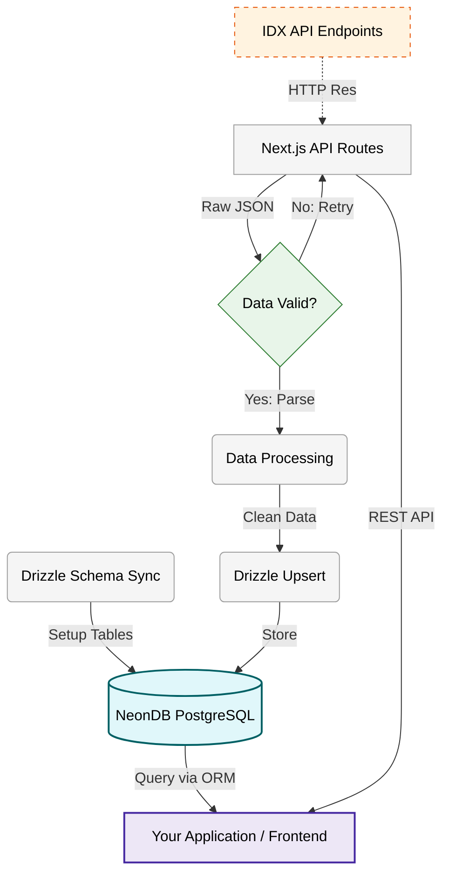

<div align="center">

# Indonesian Stock Exchange API Wrapper

A modern data pipeline for the Indonesian Stock Exchange (IDX). Built with Next.js 15, NeonDB, and Drizzle ORM to sync official market data into a structured PostgreSQL database. It features molecular architecture design, automated retries for network stability, and provides RESTful API endpoints for company info, indices, and trading data.

[](https://nextjs.org) [](https://neon.tech) [](https://orm.drizzle.team/)

[](https://github.com/NeaByteLab/IDX-API) [](LICENSE)

</div>

## Features

- **RESTful API** - Next.js App Router API endpoints for all IDX data
- **Automated Sync** - Scheduled data synchronization with retry logic
- **Official IDX Data** - Direct integration with Indonesian Stock Exchange APIs
- **Structured Storage** - PostgreSQL database with Drizzle ORM for type-safe queries
- **Serverless Ready** - Optimized for deployment on Vercel, Neon, and edge platforms
- **Molecular Architecture** - Modular design with separated concerns (Company, Market, Participants, Trading)

## Installation

> [!NOTE]
> **Prerequisites:** Node.js 18+ and npm/pnpm/yarn. You'll also need a [NeonDB](https://neon.tech) account for the PostgreSQL database.

> [!TIP]
> **Want to see the data in action?** Check out [IDX-UI](https://github.com/NeaByteLab/IDX-UI) - the interactive dashboard for your market data!

**Clone Repository:**

```bash
# Clone the repository
git clone https://github.com/NeaByteLab/IDX-API.git

# Enter the project directory
cd IDX-API/

# Install dependencies
npm install

# Copy environment file
cp .env.example .env

# Edit .env and add your DATABASE_URL from NeonDB

# Initialize the database (Drizzle generate & push)
npm run db:generate
npm run db:push
```

**Requirements:**

- **[Node.js](https://nodejs.org/)** (v18.0.0 or higher recommended)
- **[NeonDB](https://neon.tech/)** Account (Free tier available)
- **Git** (for cloning the repository)

## Technology Stack

- **Framework**: [Next.js 15](https://nextjs.org/) (React Server Components, App Router)
- **Database**: [NeonDB](https://neon.tech/) (Serverless PostgreSQL)
- **ORM**: [Drizzle ORM](https://orm.drizzle.team/) (Type-Safe SQL ORM)
- **Runtime**: [Node.js](https://nodejs.org/) / Edge Runtime compatible

## Architecture Overview



## Quick Start

### Using the API Endpoints

```bash
# Start the development server
npm run dev

# Access the API endpoints
curl http://localhost:3000/api/company/profile
curl http://localhost:3000/api/market/indices
curl http://localhost:3000/api/trading/summary?date=20240220
```

### Programmatic Usage (Server Components)

```typescript
import { db } from '@/lib/db'
import { companyProfile, stockSummary } from '@/db/schema'
import { eq } from 'drizzle-orm'

// Query company profiles
const companies = await db.select().from(companyProfile)

// Get stock summary for a specific date
const dailyData = await db
  .select()
  .from(stockSummary)
  .where(eq(stockSummary.date, '20240220'))

// Access via molecular modules
import { CompanyModule } from '@/src/Company/module'
import { MarketModule } from '@/src/Market/module'
import { TradingModule } from '@/src/Trading/module'

const company = new CompanyModule()
const profile = await company.getProfile('BBCA')

const market = new MarketModule()
const indices = await market.getIndexList()

const trading = new TradingModule()
const summary = await trading.getStockSummary('20240220')
```

For detailed usage examples, see [USAGE.md](USAGE.md).

## Module Overview

The project maintains a **molecular architecture** with separated modules that can be accessed programmatically or via REST API endpoints.

### Corporate Module (`/api/company/*`)

- `GET /company/profile` - Company metadata and profiles
- `GET /company/announcement` - Corporate news and announcements
- `GET /company/financial-ratio` - Financial indicators (PER, PBV, ROE, DER)
- `GET /company/financial-report` - Detailed financial reports
- `GET /company/dividend` - Dividend payment data
- `GET /company/stock-split` - Stock split events
- `GET /company/new-listing` - IPO and new listings
- `GET /company/delisting` - Delisted companies

### Market Module (`/api/market/*`)

- `GET /market/daily-index` - Daily index performance
- `GET /market/index-list` - Current index prices
- `GET /market/index-summary` - Daily index snapshots
- `GET /market/foreign-trading` - Foreign investor flows
- `GET /market/top-gainer` - Top gaining stocks
- `GET /market/top-loser` - Top losing stocks

### Trading Module (`/api/trading/*`)

- `GET /trading/stock-summary` - Daily OHLC and volume data
- `GET /trading/trade-summary` - Market aggregate data
- `GET /trading/broker-summary` - Broker trading activity
- `GET /trading/daily` - Real-time price snapshots
- `GET /trading/historical` - Historical trading data

### Participants Module (`/api/participants/*`)

- `GET /participants/broker` - Exchange member brokers
- `GET /participants/dealer` - Primary dealers
- `GET /participants/profile` - Participant profiles

### General Endpoints (`/api/general/*`)

- `GET /general/market-calendar` - Trading holidays and events
- `GET /general/security-stock` - Master security list

## Project Structure

```text
.
├── src/                  # Core modules (Molecular Architecture)
│   ├── Backend/          # Database schema, sync logic, and utilities
│   ├── Company/          # Corporate information module
│   ├── Market/           # Market and index module
│   ├── Participants/     # Broker and dealer module
│   ├── Statistics/       # Stock activity module
│   └── Trading/          # Trading summary module
├── app/                  # Next.js App Router
│   ├── api/              # REST API endpoints
│   │   ├── company/      # Corporate data endpoints
│   │   ├── market/       # Market data endpoints
│   │   ├── trading/      # Trading data endpoints
│   │   └── participants/ # Participant data endpoints
│   ├── layout.tsx        # Root layout
│   └── page.tsx          # Home page
├── lib/                  # Shared utilities
│   └── db.ts             # Database connection (NeonDB + Drizzle)
├── db/                   # Database layer
│   └── schema/           # Drizzle ORM schemas (PostgreSQL)
├── public/               # Static assets
├── tests/                # Unit test suites
├── sample/               # Documentation generator
└── .env.example          # Environment variables template
```

## License

This project is licensed under the MIT license. See the [LICENSE](LICENSE) file for more info.
